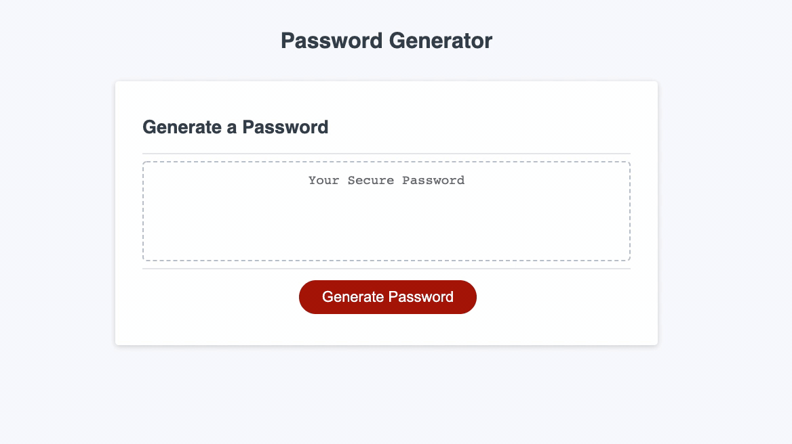

# Password Generator
>  link web page  :  https://derimarg.github.io/password-generator/

## Description

This program give you the ability of generate a random secure password based on your needs.

### Features

- When you select the red button (Generate Password), will prompt a selection of how many characters would you like to have, with a range of 8 to 128 random characters.

- Will give you the option of select wich type of characters woud you like to have (numbers, special Characters, lowercase and uppercase).

    ```html
    Numbers = [1, 2, 3, 4, 5, 6, 7, 8, 9];

    Special Characters = ["!", "#", "$", "%", "&", "'", "(", ")", "*", "+", ",",
                         "-", ".", "/", "\:", "\;", " < ", "=", " > ", " ? ", "@",
                          "[", "\\", "]", " ^ ", "_", "`", "{", "|", "}", "~"];

    LowerCase = ['a', 'b', 'c', 'd', 'e', 'f', 'g', 'h', 'i', 'j', 'k', 'l', 'm',
                 'n', 'o', 'p', 'q', 'r', 's', 't', 'u', 'v', 'w', 'x', 'y', 'z'];

    UpperCase = ['A', 'B', 'C', 'D', 'E', 'F', 'G', 'H', 'I', 'J', 'K', 'L', 'M',
                 'N', 'O', 'P', 'Q', 'R', 'S', 'T', 'U', 'V', 'W', 'X', 'Y', 'Z'];
    ```

- It depends on your selection, the program will display a random paswword at the box.

    Example:


---

### Table of Contents

- [Password Generator](#password-generator)
- [Description](#description)
- [Download](#how-to-download)
- [License](#license)
- [Author Info](#author-info)

---

#### Technologies
- HTML
- CSS
- JavaScript

[Back To The Top](#password-generator)

---

>## How To Download

- Simply copy the **SSH** to the terminal or Download the **ZIP File**:

>## Installation

 Use the follow command at your terminal, **git clone** (Create a working copy of a local repository):

```html
git clone git@github.com:Derimarg/password-generator.git
```

After cloned the repository, create your own repository, copy the files to your repository and type in your terminal the follow commands. 

```html
git status

git add -A

git commit -m "Message to commit."

git push or git push origin main
```

[Back To The Top](#password-generator)

---

## License

MIT License

Copyright (c) 2021 Derimar Gray

Permission is hereby granted, free of charge, to any person obtaining a copy
of this software and associated documentation files (the "Software"), to deal
in the Software without restriction, including without limitation the rights
to use, copy, modify, merge, publish, distribute, sublicense, and/or sell
copies of the Software, and to permit persons to whom the Software is
furnished to do so, subject to the following conditions:

The above copyright notice and this permission notice shall be included in all
copies or substantial portions of the Software.

THE SOFTWARE IS PROVIDED "AS IS", WITHOUT WARRANTY OF ANY KIND, EXPRESS OR
IMPLIED, INCLUDING BUT NOT LIMITED TO THE WARRANTIES OF MERCHANTABILITY,
FITNESS FOR A PARTICULAR PURPOSE AND NONINFRINGEMENT. IN NO EVENT SHALL THE
AUTHORS OR COPYRIGHT HOLDERS BE LIABLE FOR ANY CLAIM, DAMAGES OR OTHER
LIABILITY, WHETHER IN AN ACTION OF CONTRACT, TORT OR OTHERWISE, ARISING FROM,
OUT OF OR IN CONNECTION WITH THE SOFTWARE OR THE USE OR OTHER DEALINGS IN THE
SOFTWARE.

[Back To The Top](#password-generator)

---

## Author Info

- GitHub - [Derimar Gray](https://github.com/Derimarg)

[Back To The Top](#password-generator)